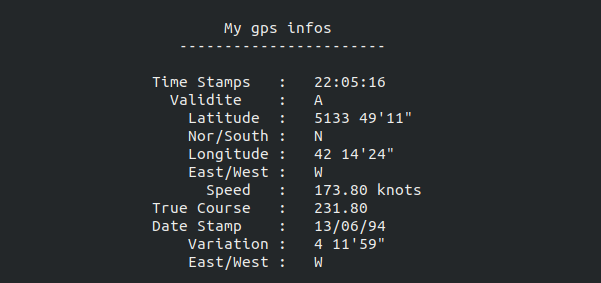

<h1>GPS String Parsing </h1>
<h2>Introduction</h2>
<p>This program is for desolving gps information string.</p>
<h2>Code steps and Explanation</h2>
<h3>Libraries</h3>

```cpp

#include<stdio.h>
#include<string.h>
#include<stdlib.h>
#include<math.h>

```
<h3>GPS module infomation Struct</h3>

```cpp

typedef struct {
     float     time;
     char    *validity; 
     float   latitude;
     char    *direction1;//North_South
     float   longitude;
     char    *direction2;//East_West
     float   speed;
     float   course;
     float     date;
     float   variation;
     char    *direction3;//East_West    
}gpsData;

```

<h3>Function for desolving informations comming from gps module and displaying it.</h3>

```cpp

void displayGpsInfo(gpsData myGps){	
   	//time putting into hh:mn:sn  format
   	int sn  = (int)myGps.time%100;
   	int mn  =  (((int)myGps.time-sn)/100)%100;
   	int hr  =  myGps.time/10000;
   	//Latitude conversion into DMS
   	int degree1 = floor(myGps.latitude);
   	int minute1 = floor((myGps.latitude-degree1)*60);
   	int seconde1= floor(((myGps.latitude-degree1)*60-minute1)*60);
   	//longitude conversion into DMS
   	int degree2 = floor(myGps.longitude);
   	int minute2 = floor((myGps.longitude-degree2)*60);
   	int seconde2= floor(((myGps.longitude-degree2)*60-minute2)*60);
   	//date putting into dd:mm:yy format
   	int day   =  floor(myGps.date/10000);
   	int year  =  fmod(myGps.date,100);
   	int month =  fmod((myGps.date-year)/100,100);  	
   	//Variation conversion into DMS
   	int degree3 = floor(myGps.variation);
   	int minute3 = floor((myGps.variation-degree3)*60);
   	int seconde3= floor(((myGps.variation-degree3)*60-minute3)*60);

    //Display gps datas
   	printf("%45s\n","My gps infos ");
   	printf("%50s\n\n","-----------------------");
   	printf("%40s  %02d:%02d:%02d\n","Time Stamps   : ",hr,mn,sn);
   	printf("%40s  %s\n",        "Validite    : ",myGps.validity);
   	printf("%40s  %d %d\'%d\"\n","Latitude  : ",degree1,minute1,seconde1);
   	printf("%40s  %s\n",            "Nor/South : ",myGps.direction1);
   	printf("%40s  %d %d\'%d\"\n","Longitude : ",degree2,minute2,seconde2);
   	printf("%40s  %s\n",            "East/West : ",myGps.direction2);
   	printf("%40s  %.2f knots\n",      "Speed   : ",myGps.speed);
   	printf("%40s  %.2f\n",      "True Course   : ",myGps.course);
   	printf("%40s  %02d/%02d/%02d\n","Date Stamp    : ",day,month,year);
   	printf("%40s  %d %d\'%d\"\n","Variation : ",degree3,minute3,seconde3);
   	printf("%40s  %s\n",            "East/West : ",myGps.direction3);
}

```
<h3>Function for parsing string comming from gps module.</h3>

```cpp

void gps(char *ptr){
	
	 gpsData myGps;
	 int   gpsIx=0;
	 char *gpsBuff;
	 
	 gpsBuff=calloc(1,strlen(ptr)+1);
	 if(ptr[0]=='$'){
	    while(ptr[gpsIx] != '*'){
	    	gpsBuff[gpsIx]=ptr[gpsIx];
	    	++gpsIx;
		}	
	 }else{
	 	puts("Invalid gps info..!");
	 	return;
	 }

	 
	 if(strstr(gpsBuff,"GPRMC")== NULL) return;
     if(strstr(gpsBuff, ",A,") == NULL) return;
 
     
	 char *token = strtok(gpsBuff,",");
	 
	 myGps.time       = atof(strtok(NULL,","));
	 myGps.validity   = strtok(NULL,",");
	 myGps.latitude   = atof(strtok(NULL,","));
	 myGps.direction1 = strtok(NULL,",");
	 myGps.longitude  = atof(strtok(NULL,","));
	 myGps.direction2 = strtok(NULL,",");
	 myGps.speed      = atof(strtok(NULL,","));
	 myGps.course     = atof(strtok(NULL,","));
	 myGps.date       = atof(strtok(NULL,","));
	 myGps.variation  = atof(strtok(NULL,","));
	 myGps.direction3 = strtok(NULL,",");
	
	displayGpsInfo(myGps);	 
	free(gpsBuff);
	return;
}

```
<h3>Demonstration</h3>

```cpp

int main(){

  char   *gpsInfo[3]={"$GPRMC,220516,A,5133.82,N,00042.24,W,173.8,231.8,130694,004.2,W*70",
                      "GPRMC,220516,A,5133.82,N,00042.24,W,173.8,231.8,130694,004.2,W*70",
                      "$GPRMC,220516,V,5133.82,N,00042.24,W,173.8,231.8,130694,004.2,W*70" 
                      };
   
   
   //gps(gpsInfo[0]);  //Valid     infoString
   //gps(gpsInfo[1]);  //invalid   infoString (no dollar sign)
   //gps(gpsInfo[2]);  //invalid   infoString ( ",V," instead of ",A," )
                     
    gps(gpsInfo[0]);

return 0;
}

```
<h3>Output Screenshot</h3>

<h3>To run this code  on  Linux based OS:</h3>
<pre> gcc gps.c -lm && ./a.out </pre>

